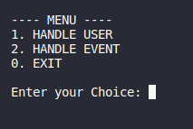
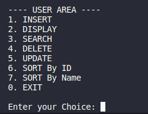
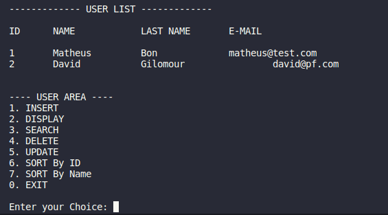
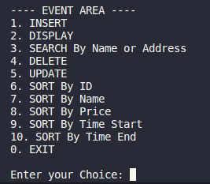
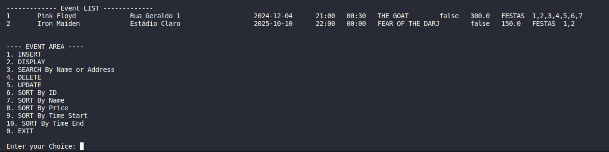

## Project Summary

This project is part of the coursework for the "Computational Solutions Programming" course unit. It's a Java console-based system for managing urban events, enabling user registration, event creation, participation, and cancellation. The system features sorting events by time and persistence in a file.

In this work, in addition to the fundamental concepts of object-oriented programming, comparison methods were used to create some types of ordering, for example, ordering by ID, Name, Price, Address, etc.

The project's difference is the _data persistence_ of the User.java and Event.java models, in the *FileHandlerController* file in Controller. In it I use the _ObjectOutputStream_ and _ObjectInputStream_ classes, this way I can _Serialize_ the models to save in a .data file.

### Implemented Features
- [x] User class creation
- [x] User registration
- [x] User reading
- [x] User updating
- [x] User deletion
- [x] Event class creation
- [x] Definition of event categories
- [x] Event registration
- [x] Event reading
- [x] Event updating
- [x] Event deletion
- [x] Persistence of users in file
- [x] Persistence of events in file
- [x] Participation in events
- [x] Participation cancellation in events
- [x] Sorting events by time
- [x] Sorting user by ID
- [x] Sorting user by Name
- [-] Identification of ongoing events
- [-] Recording past events
- [x] Search user by their attributes
- [x] Search event by their attributes

### Images
#### Main Menu

#### User Menu

#### User Table

#### Event Menu

#### Event Table
